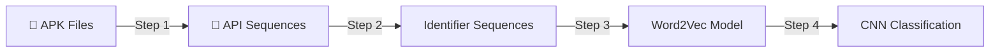
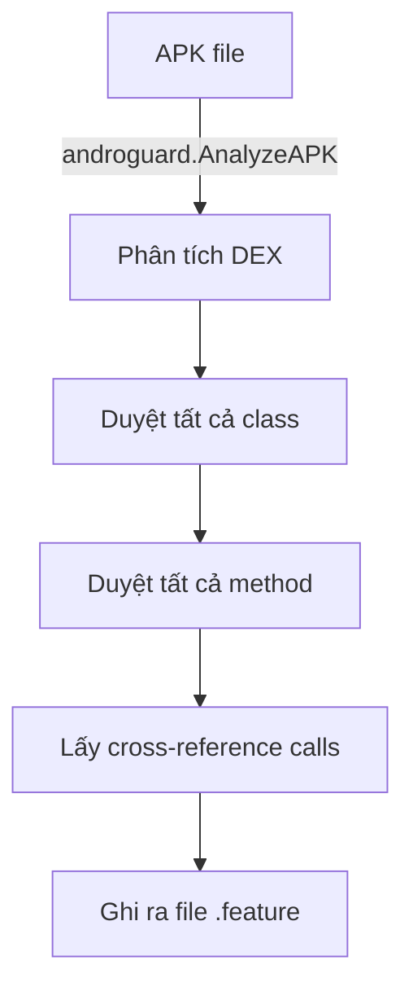
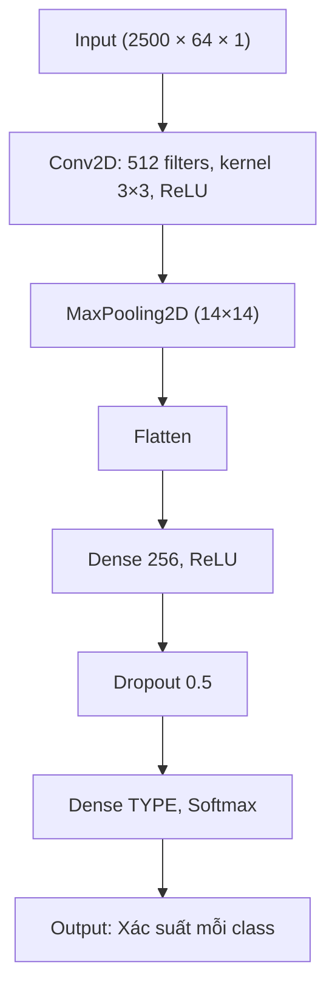

# Phân Tích MalDozer — Android Malware Detection bằng Deep Learning

## 1. Tổng Quan Dự Án

**MalDozer** là re-implementation của paper *"MalDozer: Automatic framework for android malware detection using deep learning"* (Digital Investigation 2018), được cải tiến bởi nhóm nghiên cứu ShadowDroid (ICPADS 2021).

### Ý tưởng cốt lõi
- Trích xuất **chuỗi API calls** từ file APK Android
- Dùng **Word2Vec** để biểu diễn API calls thành vector số
- Dùng **CNN (Convolutional Neural Network)** để phân loại malware/goodware

### Pipeline tổng thể



---

## 2. Phân Tích Từng File

### 2.1. `set_constant.py` — Cấu hình trung tâm

> [!IMPORTANT]
> Đây là file quan trọng nhất khi muốn train với dataset khác. Mọi tham số đều được cấu hình ở đây.

| Tham số | Giá trị mặc định | Ý nghĩa |
|---------|-------------------|----------|
| `apk_path` | `../data/apk` | Thư mục chứa APK |
| `TYPE` | `2` | Số lượng class phân loại |
| `TYPE_list` | `["goodware","malware"]` | Tên các class |
| `K` | `64` | Chiều embedding Word2Vec |
| `L` | `2500` | Chiều dài chuỗi API (cắt/padding) |
| `filter_count` | `512` | Số filter CNN |
| `kernel_size_` | `3` | Kích thước kernel CNN |
| `first_neuron_count` | `256` | Neuron lớp Dense đầu |
| `dropout` | `0.5` | Tỉ lệ dropout |
| `epochs_` | `15` | Số epoch training |
| `batch_size` | `10` | Batch size |
| `KFCV` | `True` | Bật K-Fold Cross Validation |
| `KFCV_K` | `5` | Số fold |

**Các hàm tiện ích:**
- `Get_file_line(filename, L)` — Đọc file thành list dòng, padding `'0\n'` nếu ngắn hơn L
- `sentences_append(sentences, path, L)` — Đọc tất cả file trong thư mục thành ma trận 2D
- `read_dict(path)` — Load dictionary từ file pickle
- `mkdir(path)` / `folders_set()` — Tạo cấu trúc thư mục cần thiết

**Cấu trúc thư mục được tạo:**
```
../data/
├── apk/                  ← Đặt APK ở đây
│   ├── goodware/
│   └── malware/
├── apis/                 ← API sequences (step 1 output)
│   ├── goodware/
│   └── malware/
└── identifiers/          ← Identifier sequences (step 2 output)
    ├── train/
    │   ├── goodware/
    │   └── malware/
    └── test/
        ├── goodware/
        └── malware/
```

---

### 2.2. `one_get_api.py` + `extract_feature.py` — **Step 1: Trích xuất API**

**Luồng xử lý:**


**Cách hoạt động (`extract_feature.py`):**
1. Dùng `androguard` để decompile file APK
2. Duyệt qua tất cả class → method → cross-reference (xref_to)
3. Mỗi API call được ghi dưới dạng `ClassName:MethodName` vào file `.feature`
4. Skip file đã xử lý (kiểm tra `.feature` tồn tại)

**`one_get_api.py`** là wrapper, nhận đường dẫn goodware/malware qua argparse và gọi `extract_feature()`.

---

### 2.3. `find.py` — Tạo API Dictionary

Phân tích file HTML chứa danh sách Android official classes → tạo:
- `useful_api_class` — file text danh sách API class chính thức
- `method_dict.pickle` — dictionary mapping `API_name → integer_id`

Dùng để phân biệt **official API** vs **third-party API** và ánh xạ API sang số.

---

### 2.4. `extract_third_api.py` — Trích xuất Third-party API

Đọc danh sách official API, sau đó lọc ra các API **không phải official** (third-party) từ file `.feature`. Đếm tần suất xuất hiện và lưu vào `all_third_dict.pickle`.

---

### 2.5. `two_mapping_to_identifier.py` + `two.py` — **Step 2: Ánh xạ API → Identifier**

**Cách hoạt động:**
1. Load dictionary (`method_dict.pickle`) mapping API name → integer ID
2. Đọc từng file `.feature` (API sequence)
3. Với mỗi API call: nếu có trong dict → ghi ID; nếu không → ghi `0`
4. Cắt/padding sequence đến chiều dài `L = 2500`
5. Chia ngẫu nhiên thành **train (80%)** và **test (20%)**

**Sự khác biệt giữa hai file:**
- `two_mapping_to_identifier.py` — phiên bản single-process, chia 80/20 ngẫu nhiên
- `two.py` — phiên bản multi-process (20 process), chia theo `val_split`

---

### 2.6. `three_word2vec.py` — **Step 3: Huấn luyện Word2Vec**

**Cách hoạt động:**
1. Đọc tất cả file identifier từ train + test thành corpus (mỗi file = 1 "câu")
2. Huấn luyện model Word2Vec với:
   - `size = K = 64` (chiều embedding)
   - `window = 4`
   - `min_count = 1`
   - `hs = 1` (hierarchical softmax)
3. Lưu model vào `word2vec.model`

**Kết quả:** Mỗi identifier (số) được biểu diễn thành vector 64 chiều.

---

### 2.7. `my_generator.py` — Data Generator cho CNN

**Các hàm chính:**

| Hàm | Chức năng |
|-----|-----------|
| `get_onetype()` | Đọc 1 loại (goodware/malware), chuyển identifier → vector qua Word2Vec |
| `get_apks_and_types()` | Gộp tất cả loại, tạo matrix `(N, L, K, 1)` cho CNN, normalize `/255` |
| `my_generator()` | Generator yield batch `(X, Y)` cho `fit_generator` |
| `KFCV_index()` | Tính index cho K-Fold Cross Validation |

**Luồng dữ liệu:**
```
File identifier → Word2Vec lookup → Vector (L×K) → Reshape (L, K, 1) → /255 → CNN input
```

---

### 2.8. `four_deep_learning.py` — **Step 4: Huấn luyện CNN**

**Kiến trúc CNN:**


**Training flow:**
1. Load data qua `get_apks_and_types()` → X shape `(N, 2500, 64, 1)`, Y one-hot
2. Gộp train+test, shuffle cùng seed, rồi chia lại theo tỉ lệ
3. Nếu `KFCV=True` → K-Fold Cross Validation (5 fold)
4. Nếu `KFCV=False` → chia train/val/test cố định
5. Compile với `RMSprop(lr=1e-4)`, loss `binary_crossentropy`
6. Vẽ biểu đồ acc/loss, đánh giá trên test set

**`last_four_deep_learning.py`** là phiên bản cũ hơn, load toàn bộ data vào RAM (không dùng generator), dùng `model.fit()` trực tiếp.

---

### 2.9. `confuse.py` + `plot_confuse.py` — Confusion Matrix

- `confuse.py`: Tính confusion matrix thủ công, in ra terminal
- `plot_confuse.py`: Vẽ confusion matrix đẹp bằng matplotlib + sklearn

### 2.10. `test.py` — Đánh giá model

Load model đã train, chạy trên test set, gọi `confuse()` để in confusion matrix.

### 2.11. `main.py` — Chạy toàn bộ pipeline

Chạy tuần tự 4 bước và ghi thời gian mỗi bước vào file `21.txt`.

---

## 3. Hướng Dẫn Train Với Dataset Khác

### 3.1. Chuẩn bị Dataset

#### Trường hợp A: Dataset APK files (phân loại nhị phân)

```
../data/apk/
├── goodware/          ← Đặt APK lành tính vào đây
│   ├── app1.apk
│   ├── app2.apk
│   └── ...
└── malware/           ← Đặt APK mã độc vào đây
    ├── mal1.apk
    ├── mal2.apk
    └── ...
```

Sửa `set_constant.py`:
```python
apk_path = '../data/apk'
TYPE = 2
TYPE_list = ["goodware", "malware"]
```

#### Trường hợp B: Dataset đa phân loại (nhiều họ malware)

```
../data/apk/
├── goodware/
├── Adrd/
├── FakeInstaller/
├── DroidKungFu/
└── ...
```

Sửa `set_constant.py`:
```python
apk_path = '../data/apk'
TYPE = 5  # Số class (ví dụ 5)
TYPE_list = ["goodware", "Adrd", "FakeInstaller", "DroidKungFu", "Plankton"]
```

### 3.2. Các bước thực hiện

#### Bước 0: Chuẩn bị dictionary (nếu chưa có `method_dict.pickle`)

```bash
python find.py
```

> [!WARNING]
> File `find.py` cần file HTML danh sách Android classes (đường dẫn `../../classes`). Nếu không có, bạn cần tải từ Android documentation hoặc dùng file `method_dict.pickle` đã có sẵn.

#### Bước 1: Trích xuất API calls

```bash
python one_get_api.py
```
- **Input:** APK files trong `../data/apk/{class_name}/`
- **Output:** File `.feature` trong `../data/apis/{class_name}/`
- **Thời gian:** Lâu nhất — phụ thuộc số lượng APK

#### Bước 2: Ánh xạ API → Identifier

```bash
python two_mapping_to_identifier.py
```
- **Input:** File `.feature` + `method_dict.pickle`
- **Output:** File identifier trong `../data/identifiers/train/` và `test/`

#### Bước 3: Huấn luyện Word2Vec

```bash
python three_word2vec.py
```
- **Input:** Tất cả file identifier
- **Output:** `word2vec.model`

#### Bước 4: Huấn luyện CNN

```bash
python four_deep_learning.py
```
- **Input:** File identifier + `word2vec.model`
- **Output:** `deep_learning.model` + biểu đồ acc/loss

#### Hoặc chạy tất cả bằng:

```bash
python main.py
```

### 3.3. Điều chỉnh Hyperparameters

Sửa trong `set_constant.py`:

| Khi nào | Sửa gì |
|---------|--------|
| Dataset nhỏ (< 500 APK) | Giảm `L=1000`, `K=32`, `epochs_=20` |
| Dataset lớn (> 5000 APK) | Giữ `L=2500`, tăng `batch_size=32` |
| Đa phân loại | Đổi `TYPE`, `TYPE_list` |
| Overfitting | Tăng `dropout=0.7`, giảm `filter_count=256` |
| Underfitting | Tăng `epochs_=30`, giảm `dropout=0.3` |

### 3.4. Sử dụng Dataset KHÔNG phải APK

Nếu dataset đã ở dạng **API sequence text** (không cần decompile APK):

1. **Bỏ qua Step 1** — Đặt file trực tiếp vào `../data/apis/{class}/`
2. Mỗi file text chứa 1 API call mỗi dòng: `Lcom/example/Class;:methodName`
3. Chạy từ Step 2 trở đi

### 3.5. Đánh giá kết quả

```bash
python test.py
```

Hoặc chỉnh `four_deep_learning.py` để in thêm metrics (precision, recall, F1).

---

## 4. Lưu Ý Quan Trọng

> [!CAUTION]
> - Code sử dụng **Keras cũ** (standalone). Nếu dùng TensorFlow 2.x, thay `from keras.xxx` → `from tensorflow.keras.xxx`
> - `model.predict_classes()` đã bị deprecated trong TF2 — thay bằng `np.argmax(model.predict(x), axis=1)`
> - `fit_generator()` đã deprecated — thay bằng `model.fit()` trực tiếp với generator
> - Tham số `size` trong Word2Vec đã đổi thành `vector_size` trong gensim mới

> [!TIP]
> Để chạy được với thư viện hiện đại, bạn cần cài: `pip install androguard gensim tensorflow scikit-learn matplotlib`
